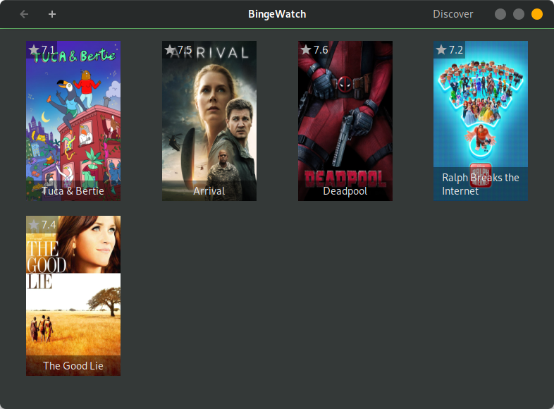

<h1 align="center">
    📺 BingeWatch
</h1>
<h3 align="center">BingeWatch is a Linux Gtk app that helps you organize and watch your movies and tv shows.</h3>

<p align="center">
  
</p>

### ⚠️ This project is still under development ⚠️

# 🛠 Build

You need `ldc` and `dub` installed on your system.

First get your themoviedb.org API_KEY from [here](https://www.themoviedb.org/settings/api)

Then Add it to [source/config.d:5](source/config.d#L5):

```D
static {
    // REPLACE WITH YOUR OWN API KEY
    immutable API_KEY = "";
}
```

And then compile and run the program:

```bash
cd BingeWatch
dub --compiler=ldc
```

# 📜 License

BingeWatch is a free software and is licensed under GNU Public License v3+

For more information see [LICENSE](LICENSE)
